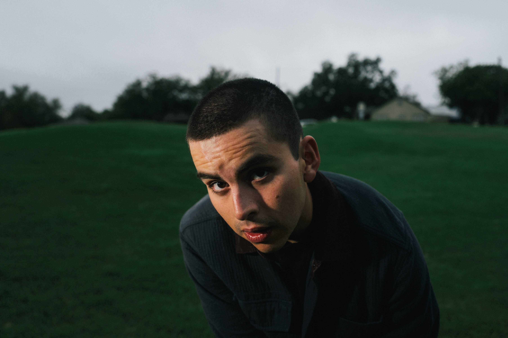

<figure style="text-align: center;">
  
</figure>

My name is Fernando Palafox Escobedo. I was born and raised in Mexico City. My father's family is from the small town of [Amecameca](https://en.wikipedia.org/wiki/Amecameca), where I spent many, many happy childhood days. When I was 18, I moved to Boulder, Colorado where I earned my Bachelor's and Master's degrees in Aerospace Engineering from the University of Colorado Boulder. During my time there, I worked on satellite navigation technologies and software-defined radios at the [RF & SatNav Laboratory](https://www.colorado.edu/lab/rf-satnav/) with [Dr. Dennis Akos](https://www.colorado.edu/aerospace/dennis-akos). I'm currently a PhD student at the University of Texas at Austin, where I work on multi-agent interactions with [Dr. David Fridovich-Keil](https://www.ae.utexas.edu/people/faculty/faculty-directory/fridovich-keil) at the [CLeAR Laboratory](https://clearoboticslab.github.io/). You can read more about my research [here](research.md).