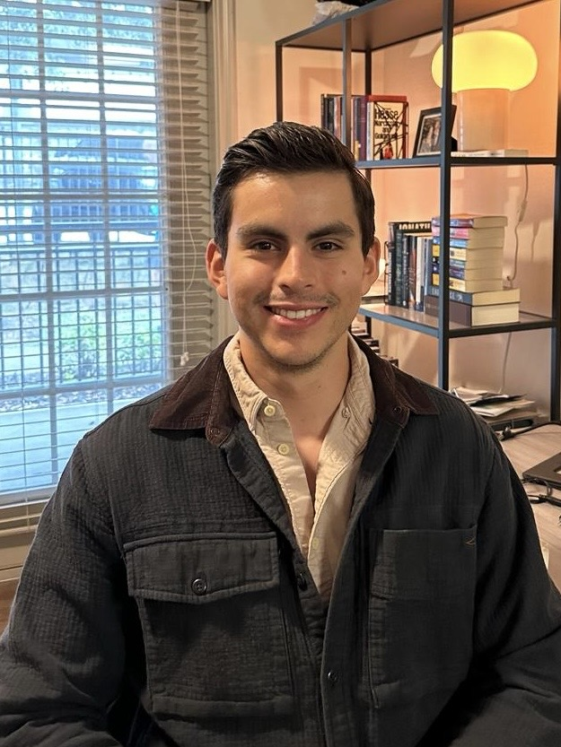

<figure style="text-align: center;">
  
</figure>

I am a PhD student in robotics and AI advised by [Dr. David Fridovich-Keil](https://www.ae.utexas.edu/people/faculty/faculty-directory/fridovich-keil).

I have Bachelor's and Master's degrees in aerospace Engineering, and I used to work on [satellite navigation systems](https://www.ion.org/publications/abstract.cfm?articleID=18230).
For my PhD I decided to focus on decision-making in the context of robotics, as it's the perfect combination of engineering and philosophy. 
Find my research [here](research/index.md).

I was born and raised in Mexico City and I like [reading](bookshelf), [writing](writing), and [working out](fitness.md).

Find me on [X](https://twitter.com/p_lafox), [LinkedIn](https://www.linkedin.com/in/fernando-palafox/), [Substack](https://fernandopalafox.substack.com/), or [GitHub](https://github.com/fernandopalafox).

---

This website was created with <a href="https://quartz.jzhao.xyz/">Quartz 4.
