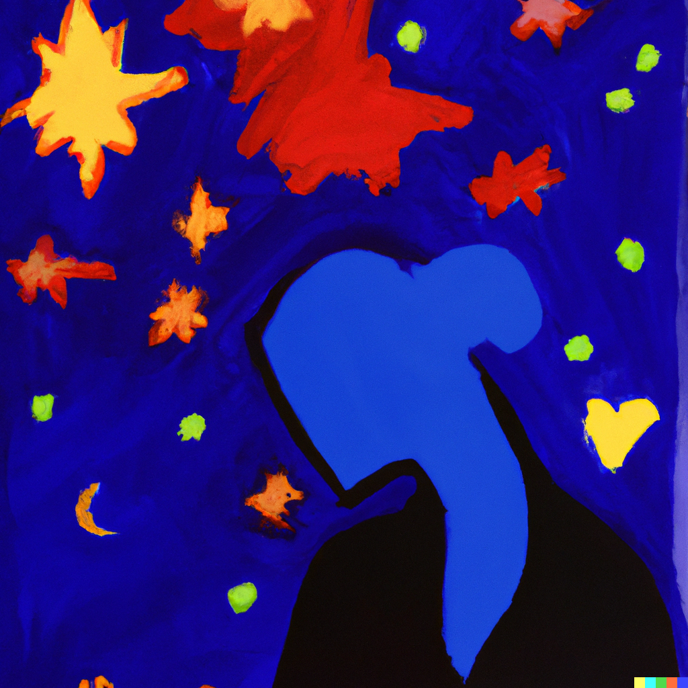

<figure style="text-align: center;">
  
  <figcaption style="max-width: 95%; margin: auto;"><em>Prompt: A Matisse painting of a woman and a starry night.</em></figcaption>
</figure>

I'm currently going through a hard breakup. We ended the relationship on good terms and the reasons were relatively benign. And in the long run, this may even be better for both of us, given our current priorities. I'm also old enough to know that time, does indeed, heal all wounds. Still, no amount of reflecting turns off the whirlwind of emotions I feel right now. 

Perhaps one of the most memorable experiences I've had in my life was lying in next to her, looking straight into her eyes and realizing that in her gaze I saw everything. I realize how corny this sounds, but believe me, in that moment, looking at her eyes was like seeing the Milky Way on a starry night. The meaning of my life was realized in her big blue eyes. Nothing else mattered. I've never felt anything like that before. And I guess that when you're lucky enough to meet someone that elicits those emotions, it's easy to let them become part of you. And I mean this literally: she became a part of who I am, a part of the substance, the experience, the feeling I refer to as "me". And right now, the idea of  continuing life without her feels unfathomable. No, I am not suicidal. What I'm trying to say is that my current conception of self is not compatible with a the future without her. It feels like someone asking me to look without using my eyes. To speak without moving my mouth. I don't this mean to sound like a [koan](https://www.merriam-webster.com/dictionary/koan), but I'm trying to convey what it feels like when my understanding of who I am in the world feels thoroughly incompatible with a future without her. 

I constantly find myself making projections about the future, and the moment I realize she won't be there, I get the same split-second feeling of falling you get when sitting back on a chair that you thought was there but wasn't. Or when you take a step and there's no ground beneath you. 

But after mulling over this for a bit, I think the way this feeling of resolves is by realizing that "I" am not static (and an [illusion](https://www.youtube.com/watch?v=fajfkO_X0l0)). My current sense of "self" is not compatible with a future without her. But it won't need to be, because it will change. This makes me a bit sad, and as accepting it feels like growing past a part of me that made me so happy. But what's the alternative? 

This also gets me thinking about my place in a relationship. Should I be letting the idea that I identiy as "me" to depend on someone else. If anything that can taken away is not really yours, [(*omnia mea mecum sunt!*)](https://en.wikipedia.org/wiki/Omnia_mea_mecum_porto), then how much should I let another person what I think of as myself? I'm not sure, but perhaps this is also what makes relationships so special. If she hadn't become a part of me, would I have really seen the universe in her eyes? And also, I'm not sure one even has a choice in the matter.

Ah well, I'm sure I'll look back at this in a few months and laugh at how dramatic I was being. But for now, I'll let myself feel sad.