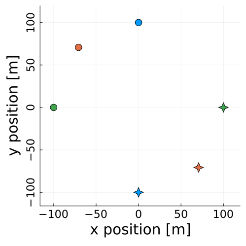
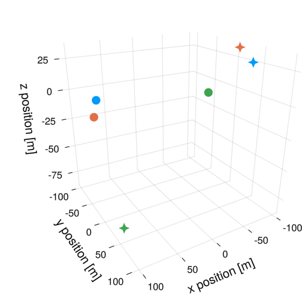

![[headshot.jpg|250]]

 I am a PhD student at the Department of Aerospace Engineering at UT Austin. I am interested in **artificial intelligence for multi-agent interactions**. Concretely, I design control strategies for multi-agent interactions so that robots can safely, and smoothly, interact with other robots or humans. My work leverages dynamic game theory, optimal control, and machine learning. I am part of the the [CLeAR Laboratory](https://clearoboticslab.github.io/) and I am advised by [Dr. David Fridovich-Keil](https://www.ae.utexas.edu/people/faculty/faculty-directory/fridovich-keil) .

If you'd like to talk, [email](mailto:fernandopalafox@utexas.edu) me or DM me on [X](https://twitter.com/p_lafox). You can also find me on [Google Scholar](https://scholar.google.com/citations?user=q0dyHx4AAAAJ&hl=en), [GitHub](https://github.com/fernandopalafox), [LinkedIn](https://www.linkedin.com/in/fernando-palafox/), [Instagram](https://www.instagram.com/palaf_x/), or [Strava](https://www.strava.com/athletes/27635180).

Here's a recent project on [hyperplane inference for collision-avoidance in space](https://github.com/fernandopalafox/InverseHyperplanes.jl)

<table>
  <tr>
    <td style="height: 10px;">1. Noisy expert data</td>
    <td style="height: 10px;">2. Inferred hyperplanes</td>
    <td style="height: 10px;">3. Collision-free trajectory</td>
  </tr>
  <tr>
    <td valign="top"></td>
    <td valign="top"></td>
    <td valign="top"></td>
  </tr>
 </table>

Other projects (links forthcoming)
* Autonomous driving using sequential quadratic programming
* Autonomous driving using kinodynamic goal-bias RRT
* Maximum-likelihood estimation of signal-to-noise ratio for GNSS signals

### Other interests/links
- [Health and longevity](health.md)
<!---
- [Brief bio](bio.md)
- [Non-technical AI resources](ai-resources.md)
- [Favorite blogs and links](blogs.md)
- [Favorite podcasts](podcasts.md)
- [Books I'm reading](books.md)
-->