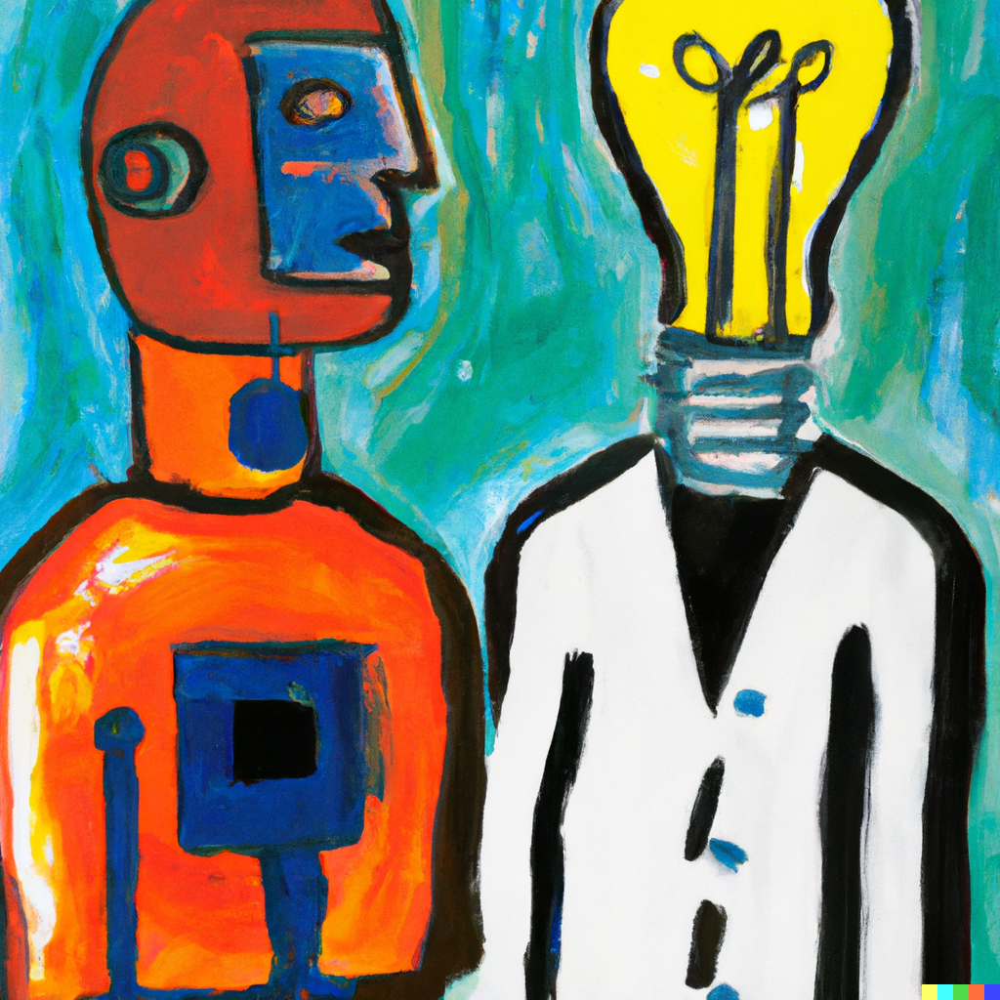

<figure style="text-align: center;">
  
  <figcaption style="max-width: 95%; margin: auto;"><em>Prompt: A Matisse oil painting of a humanoid robot and human next to each other. The robot is looking at the human. The human has a lightbulb on its head, symbolizing a creative leap.</em></figcaption>
</figure>

This is a collection of my favorite ideas from [*The Beginning of Infinity* by David Deutsch](https://www.thebeginningofinfinity.com/). It is meant mostly as a personal reference, and is by no means a comprehensive summary and/or book review. The book is really good though, and I highly recommend it. All quotation are pulled from the book unless otherwise noted. If you're lazy, perhaps the most succinct explanation of Deutsch's thesis is encapsulated in this quotation:

> "We cannot create knowledge other than by the fallible method of conjecture and criticism; errors are inevitable, and only error-correcting processes can succeed or continue for long."

**Table of Contents**
- [Key ideas in *The Beginning of Infinity*](#key-ideas-in-the-beginning-of-infinity)
- [Quotations](#quotations)
- [Final thoughts](#final-thoughts)
- [Resources](#resources)

# Key ideas in *The Beginning of Infinity*

**All progress depends on good explanations.** Explanations are knowledge about what is true, what it does, and how and why. They are important because they give us the power to transform nature in a way that is only limited by the laws of nature. If it's not forbidden by the laws of physics, it's achievable given the right knowledge.
> "The uniquely significant thing about humans is our ability to create new explanations."

**Don't minimize errors, maximize error correction.** We should aim to build decision-making frameworks (for governments, companies, research, or even ourselves) that optimize for good error-correction, instead of making good decisions. Problems are inevitable, and we should think of solving them as replacing problems with better problems. This is because, short of stasis, problems will always occur. Unfortunately, stasis is not sustainable. And claiming that problems won't occur is equivalent to claiming one has prophetic knowledge of the future.
> "If we choose to embark on an open-minded journey of creation and exploration whose every step is unsustainable until it is redeemed by the next, then the ascent of man, the beginning of infinity, will have become, if not secured, then at least sustainable."

**Humans are unique in their capacity to conjecture new explanations.** The process of creating a new and better explanation is not cumulative: we don't incrementally build our way there. Instead, we take a creative leap to conjecture an explanations. We then stress test the explanation through criticism, and if it survives, we adopt it. Sustained and rapid growth depends on the following cycle: conjecture, criticism, and explanation. Also remember that we can use our unique creativity in two ways:
1. Replicate the dominant explanations as faithfully (and creatively) as possible. This is the sign of a static society, one vulnerable to unexpected problems.
2. Come up with new and possibly better explanations about how the world works. If it survives criticism, build on it and repeat the cycle: conjecture, criticize, explain.
> "Explanatory knowledge can give us the power to transform nature in a way that is not limited by parochial observations, but by universal laws."

**Ideas replicate by being useful (i.e., closer to the truth) or by crippling critical thought.** Always be mindful of this when you learn a new idea. Does this idea improve my error-correction capabilities? Or, does it shut down critical thought?

**Observations are not independent of theory.** We only know what to look for if we have an underlying explanation for how something works. This reminds me of Kuhn's thoughts on the practice of normal science (the regular work a scientist conducts after settling on a paradigm):
> “The man who is striving to solve a problem defined by existing knowledge and technique is not, however, just looking around. He knows what he wants to achieve, and he designs his instruments and directs his thoughts accordingly. Unanticipated novelty, the new discovery, can emerge only to the extent that his anticipations about nature and his instruments prove wrong. . . . There is no other effective way in which discoveries might be generated.”
― Thomas S. Kuhn, The Structure of Scientific Revolutions

**We should be optimists even if we can never eliminate all problems.** Pessimism about the future is like claiming you have prophetic knowledge of the world. And in the words of Nils Bohr: "It is difficult to make predictions, especially about the future." It's also easier to be creative about something when you're optimistic, and creativity is how we find solutions to hard problems. 
> "The future is not yet imaginable!"

**We learn by guessing.** The communication of new ideas depends on creative guesswork on the part of both the recipient and the communicator. This is necessary because language and behavior are inherently lossy communication channels. We observe behavior, conjecture an explanation, criticize and test it, and then tentatively adopt it.
> "It is impossible to speak in such a way that you cannot be misunderstood." - Karl Popper

# Quotations
- "We should expect AI to be achieved in a jump to universality, starting from something much less powerful."
- "Whenever a wide range of theories accounts equally well for a phenomenon, there is no reason to prefer one of them over the others."
- "If an explanation could easily explain anything in the given field, then it actually explains nothing."
- "In the unique case of humans, the difference between a hospitable environment and a death trap depends on what knowledge they have created."
- "Who created the knowledge in a program matters. If it was the designer, then the program is not an AI. If it was the program itself, then it is an AI."
- "It is very rare for practical solutions to fundamental problems to be discovered without any explanation of why they work."
- "The analogue of evolutionary change in a species is creative thought in a person."

# Final thoughts
I really enjoyed this book and will probably read it again in a year or two. Although I wasn't thoroughly convinced by the chapters on aesthetics, and I have to reread the chapters on morality and the human's role as universal explainers, I highly recommend the book if any of the above points interested you. Finally, I am grateful to my friend Stefan for the recommendation. 

# Resources
- [Peter Thiel's *Zero to One*](https://en.wikipedia.org/wiki/Zero_to_One). His idea on how wealth is generated by satisfying an unmet need instead of incrementally improving what already exists (hence, the book's title), is similar to the conjecture, criticize, explain cycle. 
- [Bryan Johnson on Zeroth-Principles Thinking](https://medium.com/future-literacy/zeroth-principles-thinking-9376d0b7e7f5).
- [Karl Popper on the growth of human knowledge](https://plato.stanford.edu/entries/popper/#GrowHumaKnow). Deutsch's biggest influence when writing this book.
- [Naval and David Deutsch on Knowledge Creation and The Human Race](https://nav.al/david-deutsch)
- [Other books I've read](books.md)
