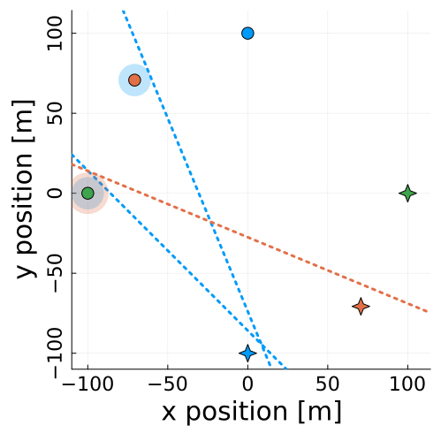

 
 I am a PhD student at the Department of Aerospace Engineering at UT Austin. I am interested in **artificial intelligence for multi-agent interactions**. Concretely, I design control strategies for multi-agent interactions so that robots can safely, and smoothly, interact with other robots or humans. My work leverages dynamic game theory, optimal control, and machine learning. I am part of the [CLeAR Laboratory](https://clearoboticslab.github.io/) and I am advised by [Dr. David Fridovich-Keil](https://www.ae.utexas.edu/people/faculty/faculty-directory/fridovich-keil).
 
Here's a project I'm working on right now: [hyperplane inference for collision-avoidance in space](https://github.com/fernandopalafox/InverseHyperplanes.jl)

<table>
  <tr>
    <td style="height: 10px;">1. Noisy expert data</td>
    <td style="height: 10px;">2. Inferred hyperplanes</td>
    <td style="height: 10px;">3. Collision-free trajectory</td>
  </tr>
  <tr>
    <td valign="top"></td>
    <td valign="top"></td>
    <td valign="top"></td>
  </tr>
 </table>

In the past I've also worked on software-defined radios for satellite navigation systems and low-cost, local positioning systems. 
 
### Projects
* Autonomous driving using sequential quadratic programming
* Autonomous driving using kinodynamic goal-bias RRT
* Maximum-likelihood estimation of signal-to-noise ratio for GNSS signals
* [Link to PDFs](https://drive.google.com/drive/folders/1F9Ay-TXPotFZ08XSMGUULeJu0NBLtuFX?usp=sharing)

[Google Scholar](https://scholar.google.com/citations?user=q0dyHx4AAAAJ&hl=en).